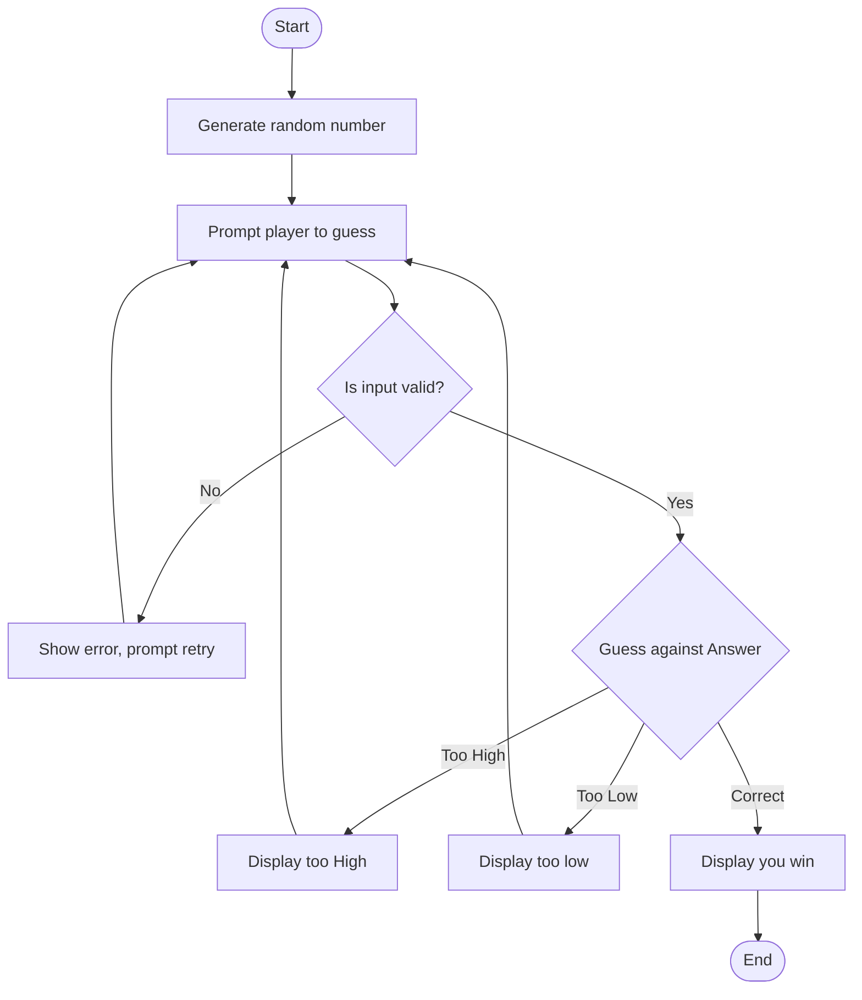

Start: Where the game begins.
Generate: Generates a random number(maybe 1-100).
Player Input: The game asks player to guess the number.
Validate: Number is checked to see if its a valid input(1-100 or just a numerical value)
Error: If given input is out or range or is not a numerical value, they are shown an error message and sent back to the guess screen in order to try again.
Check: Compares number inputted to number chosen. If the guess is correct then a "win" message is displayed.
If number is too high or low it shows up on the screen. Then the player is redirected to the guess to screen in order to retry.
If player guesses number correctly the game will end.
